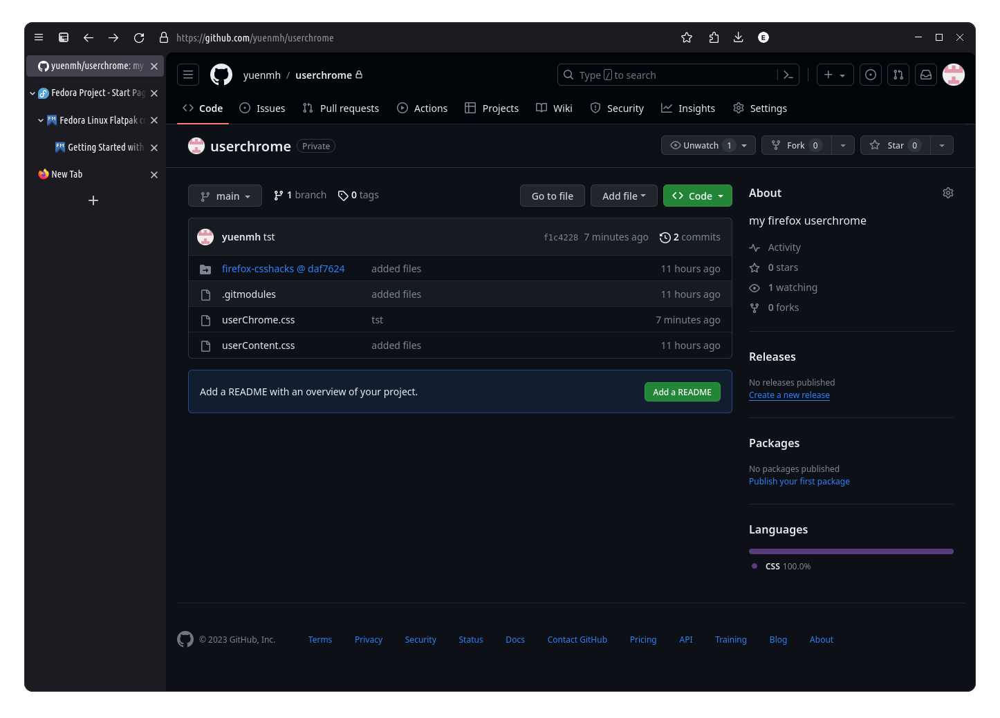

# Firefox user chrome

My Firefox `userChrome.css`. Mostly copied from [Bali10050/FirefoxCSS](https://github.com/Bali10050/FirefoxCSS/blob/main/userChrome.css)),
with a few changes to disable normal Firefox tabs and make TST look nicer.

